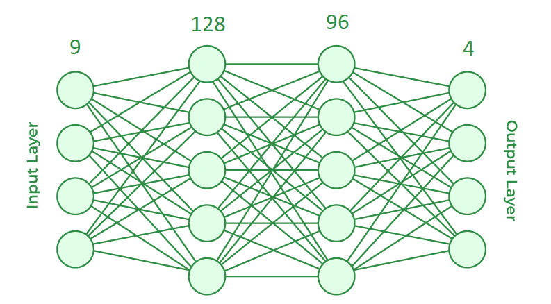
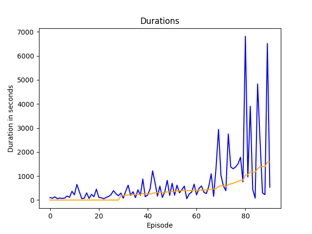

# Asteroids DQN Agent - документация

Първоначалната идея беше да се направи среда, подобна на [Atari Asteroids][Atari-Asteroids], и агент,
който умело да навигира из астероидния пояс. Оказа се, че да се направи компетентен агент за тази игра
не е лесно да се направи.

## Среда

Средата е направена от мен и е съвместима с ***Gymnasium API***.

### Сложна среда

Средата представлява ***2D*** игрално поле, в което играчът (агентът) може да:
- се движи напред
- да се върти около оста си (т.е. две действия - върти се наляво или надясно)
- стреля с лазер, който се зарежда за определено време (например има по един изстрел на секунда).

Всички смислени комбинации от горните могат да се изпълнят едновременно. Значи възможните действия са
общо 12 на брой:
```
00 DO_NOTHING
01 SHOOT
02 ROTATE_CNTR
03 ROTATE_CL
04 MOVE (meaning move forward)
05 SHOOT, ROTATE_CNTR
06 SHOOT, ROTATE_CL
07 SHOOT, MOVE
08 ROTATE_CNTR, MOVE
09 ROTATE_CL, MOVE
10 SHOOT, ROTATE_CNTR, MOVE
11 SHOOT, ROTATE_CL, MOVE
```

"Враговете" на играча ***астероиди*** с различна големина и скорост, които се появяват (*spawn-ват*) през
определено време в края на игралното поле. Ако астероид удари играча, играта приключва. При удар на 
астероид с изстрел от лазера астероидът се унищожава, ако е достатъчно малък или се разбива на по-малки,
ако е голям. Целта на играта е агентът да оцелее възможно най-дълго време и да разбие възможно най-много
астероиди.

### Проста среда

Горната среда звучи забавна за игра (и наистина е :)), но след много проби и грешки се оказа твърде 
трудна за "научаване" от ***DQN агент***. Затова се наложи да я опростя значително, за да има някакво 
надежда за компетентен агент. Ето и промените:
- агентът започва в средата на полето и може само да се върти около оста си и да стреля - не може да се 
  движи напред
- има само един малък астероид на полето

Възможните действия са значително по-малко (този път не позволяваме комбинации от действия):
```
00 DO_NOTHING
01 SHOOT
02 ROTATE_CNTR
03 ROTATE_CL
```

***Това е средата ползвана за трениране.***

## Агент

Финалният агент е *изцяло свързана невронна мрежа* с два скрити слоя.



Ето и резултатите от тренирането - времето на всеки епизод измерено с секунди:



## Източници и външни ресурси

### Източници

- [Playing Atari with Deep Reinforcement Learning - paper][original-DQN-paper]
- [Gymnasium API][gymnasium]
- [DQN With PyTorch][DQN-with-pytorch]
- [Q-Learning - geeksforgeeks][geeks-q-learning]
- [Deep Q-Learning - geeksforgeeks][geeks-deep-q-learning]
- [G-Learning - Wiki][wiki-q-learning]

### Python библиотеки (ключовите).

- `gymnasium` - предоставя стандартен *API* за средата.
- `matplotlib` - за направата на графики от тренировъчните резултати.
- `pygame` - удобни функции за чертаене на екрана; готов *game loop*, приемащ с *keyboard input*.
- `torch` - създаване и трениране на невронните мрежи.


[Atari-Asteroids]: https://en.wikipedia.org/wiki/Asteroids_(video_game)

[DQN-with-pytorch]: https://pytorch.org/tutorials/intermediate/reinforcement_q_learning.html#dqn-algorithm

[geeks-deep-q-learning]: https://www.geeksforgeeks.org/q-learning-in-python/

[geeks-q-learning]: https://www.geeksforgeeks.org/q-learning-in-python/

[gymnasium]: https://gymnasium.farama.org/

[original-DQN-paper]: https://arxiv.org/abs/1312.5602

[wiki-q-learning]: https://en.wikipedia.org/wiki/Q-learning